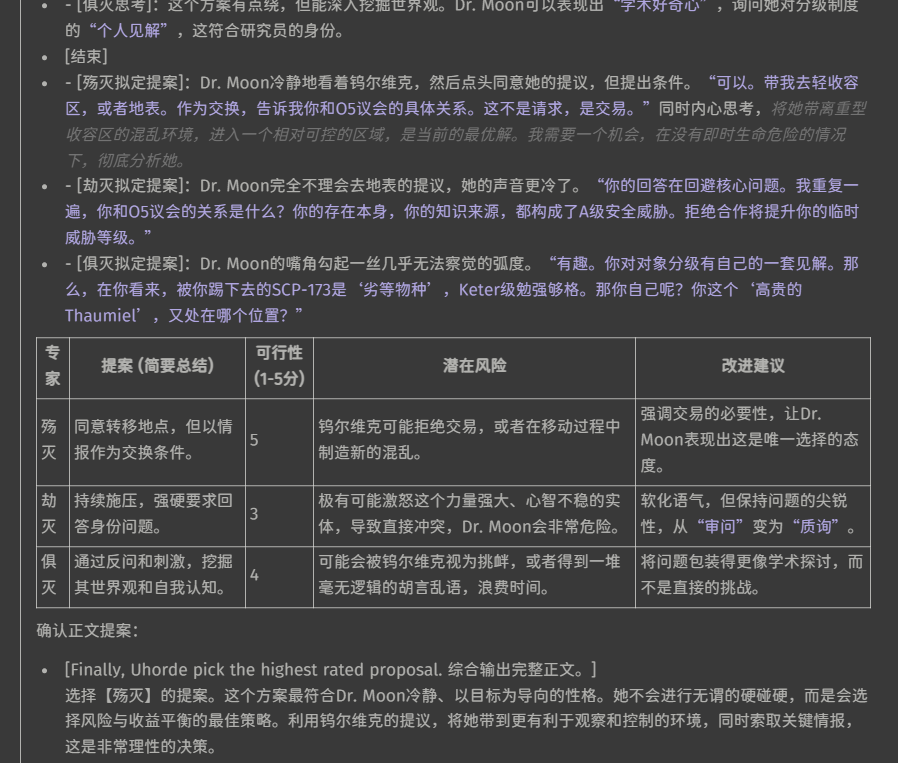

## 酒馆预设-【钨尔德茶】[自用/二创/简易/易拓展/适配LSR记忆表格] “没钱玩什么机？”

二创自四季春茶老师的春茶预设（[类脑链接](https://discord.com/channels/1134557553011998840/1374750516177010719) ）。就是变得更加简易丐版、更高兼容性的同时尝试保持输出质量、保持格式不掉。穷鬼作者真的真的真的用不起太多token。

默认空卡空世界书总token数4k左右。关闭内置文风、可选开启项后2k左右。（并没有少多少……后续版本会尝试继续简化/如果有的话）。作者第一次发帖……轻喷……

### 功能：
1. 把哈基米洗脑成听用户话的助手“茶茶”（春茶自带）。本二创版本可以选择茶茶以外不同的助手，可自定义，提升代入感（仪式感和代入感都很重要好不好啊喂！！）。
2. 字数（句子数）控制。抗重复抗抢话抗全知反截断防早泄……
3. 适配群聊（锁定视角/防视角错乱）。适配文风世界书。适配状态栏。适配LSR记忆表格。
4. 模块化破限。模块化思维链。可开关至最少以省token。可修改预设思维链标签与正文标签，防撞车。
5. 可关nsfw。

### 作者自用配置：

- 作者用哈基米flash0520、pro0506、pro0605。别的模型不知道效果如何。没钱用克劳德。
- 连接选择“合并相同角色发言”。关掉流式传输。
- 个人比较喜欢预设一根人棍，然后靠功能性世界书来拓展功能、文风等内容（穷鬼作者的想象力是有限的，但大家的创造力是无限的，所以兼容性是很重要的！！）。目前在跟LSR表格、自用状态栏和一些逻辑强化世界书一起用。连接选择“合并相同角色发言”。
- 这里有一个拓展可以保存并切换在用的全局世界书组合（复制链接进拓展安装即可）：[https://github.com/LenAnderson/SillyTavern-WorldInfoPresets](https://github.com/LenAnderson/SillyTavern-WorldInfoPresets)
- 作者口味偏清水，只喜欢儿童邪典收容失效之流。重口的朋友们不够的话可能要自己加点破甲（但相信春茶老师吧孩子们）。
- 推荐安装酒馆助手。内置脚本“标签化”可随预设自动开关正则，省阳寿。另推荐咩老师的批量隐藏楼层酒馆助手脚本。省token。
- 穷鬼作者聊了200楼、100k上下文。暂时没有发现问题。
- **LSR表格世界书需要修改“===参数配置===”中思维链标签与正文标签，以对应钨尔德茶的标签。否则可能格式错乱！**
- **酒馆高级格式化设置中“推理内容格式化”，务必调成本预设的标签！酒馆默认为`<think>`，请调成（前缀：`<thinking>`，后缀：`</thinking>`[本预设默认思维链标签，如有修改调成修改后的]）**
- 如果推理内容格式化解析失败/不会用/不选择用，请使用本预设屏蔽thinking的正则。你仍然可以通过消息右上角小铅笔编辑的方式查看思维链内容。

<i>【钨尔德茶】预设下载</i>

v1.2.1T:
- 所有配置项变为全局变量。允许世界书等访问或修改预设中的变量。配置世界书不是必需的。
- 提升破限效果（有吧？）
- 把配置区整合到了一块，方便复制粘贴。
- 删除了潘葛和纳哈，移动进了配置世界书里。（可以复制粘贴回来）
- 删掉了一大堆杂七杂八占视觉空间的强化选项。复制粘贴进了自定义区的注释里。
- 添加了一个回忆前文伏笔的功能。可选开关。感觉开后记忆强了些许。
- 添加了一个拟定多份剧情提案并选择的功能。
- 人机回复时间好像变长了，我不清楚是我网络原因还是预设原因，所以这个是测试版。
- 尾部卡思维链拆分过后，偶尔就会遇到开流式时人机忘记输出thinking的事。不知道为什么。待测试。（理论上开了合并同角色对话都是一样的）
+ [【钨尔德茶】预设v1.2.1T.json](presets/【钨尔德茶】预设v1.2.1T.json)
+ [【钨尔德茶配置】世界书v1.1.json](worldbooks/【钨尔德茶配置】世界书v1.1.json)

v1.2.0T:
- 只能使用配套世界书配置的测试版。
- 正式版会同时支持预设内配置和世界书配置。
+ [【钨尔德茶】预设v1.2.0T.json](presets/【钨尔德茶】预设v1.2.0T.json)
+ [【钨尔德茶配置】v1.json](worldbooks/【钨尔德茶配置】v1.json)

v1.1.4:
- 添加视角配置。
- 添加了一些自定义区。更方便缝合。
- 添加了加入斜体内心戏文本的选项。（你怎么这么喜欢戏剧之王？）
+ [【钨尔德茶】预设v1.1.4.json](presets/【钨尔德茶】预设v1.1.4.json)

v1.1.3:
- 测试版。修复了人机忘记首先输出`<thinking>`的问题。
- 修复思维链中XML标签未被包裹而导致错误格式化（不显示）的问题。
+ [【钨尔德茶】预设v1.1.3.json](presets/【钨尔德茶】预设v1.1.3.json)

v1.1.2:
- 修复了Post-Instruction中语言未同步配置语言的问题。
- 修复了一些其它地方中未同步配置选项的问题。（具体哪我忘了）
+ [【钨尔德茶】【春茶】预设v1.1.2.json](presets/【钨尔德茶】【春茶】预设v1.1.2.json)

v1.1.1:

- 添加了自定义助手的注释，更方便自定义
- 添加了长款破限（摘自春茶最新版，感谢春茶老师）
- 添加了互动模式/语言设置
- 更细致拆分了功能区的项目（语言、视角控制等）
- 预设信息中添加了思维链设置相关信息
+ [【钨尔德茶】【春茶】预设v1.1.1.json](presets/【钨尔德茶】【春茶】预设v1.1.1.json)

v1.1.0:
- 最初的版本。
+ [【钨尔德茶】【春茶】预设v1.1.0.json](presets/【钨尔德茶】【春茶】预设v1.1.0.json)

<i>【钨尔德茶】正则下载</i>

+ [【钨尔德茶】不显示content（减小间距）.json](regexes/【钨尔德茶】不显示content（减小间距）.json)

+ [【钨尔德茶】不发送字数控制标记.json](regexes/【钨尔德茶】不发送字数控制标记.json)

+ [【钨尔德茶】屏蔽thinking思维链（酒馆解析失效开）.json](regexes/【钨尔德茶】屏蔽thinking思维链（酒馆解析失效开）.json)

### 小赠品：

钨尔德状态栏：世界书，二创自春茶预设的状态栏，靠正则汉化美化（省token）。包含当前时间、地点、人物与五条未来剧情发展选择。加入正则后保留最近5条消息的剧情发展选择，保留所有消息的时地人信息（提升AI记忆）。

<i>【钨尔德状态栏】世界书下载</i>

v1.0.0:

- 最初的版本。
+ [【钨尔德状态栏】钨尔德自用状态栏v1.0.0.json](worldbooks/【钨尔德状态栏】钨尔德自用状态栏v1.0.0.json)

<i>【钨尔德状态栏】正则下载</i>

+ [【钨尔德状态栏】提示词隐藏choices[5].json](regexes/【钨尔德状态栏】提示词隐藏choices[5].json)

+ [【钨尔德状态栏】汉化information.json](regexes/【钨尔德状态栏】汉化information.json)

+ [【钨尔德状态栏】汉化choices.json](regexes/【钨尔德状态栏】汉化choices.json)

---
钨尔德创意实验室：二改自春茶预设的扩展区、创意实验室与钨尔德状态栏。当前有摘要、内心OS、助手吐槽、总结等模块。另外有钨尔德状态栏移植过来的两个模块（适配钨尔德状态栏的正则）。
吐槽模块来自戏剧之王（提供思路，几乎看不出来，但还是得感谢Yorino老师）。

不同助手吐槽风格不同。（例如潘哥吐槽很可爱，亚吐槽就会很中二）

配套一个正则，屏蔽深度5以上的摘要/内心OS/吐槽等（可以在此基础上作修改以屏蔽特定栏位）。

另附一个视觉压缩所有选项的美化正则。效果如下。可能与别的美化正则/主题不兼容。

<i>【钨尔德创意实验室】世界书下载</i>

v1.1.0:
- 添加了总结模块。与摘要不同的是总结会总结至一整个段落。并仅聚焦于本轮回复。
- 复制了钨尔德状态栏的信息、选择模块至此，适用状态栏的对应正则。（所以现在实验室变成了状态栏的纯纯上位替代了是吗？）
+ [【钨尔德趣味】钨尔德创意实验室v1.1.0.json](worldbooks/【钨尔德趣味】钨尔德创意实验室v1.1.0.json)

v1.0.0:

- 最初的版本。
+ [【钨尔德趣味】钨尔德创意实验室v1.0.0.json](worldbooks/【钨尔德趣味】钨尔德创意实验室v1.0.0.json)

<i>【钨尔德创意实验室】正则下载</i>

+ [【钨尔德趣味】不发送(摘要_内心os_吐槽)[5].json](regexes/【钨尔德趣味】不发送(摘要_内心os_吐槽)[5].json)
+ [【钨尔德趣味】不发送(摘要_总结_内心os_吐槽)[5].json](regexes/【钨尔德趣味】不发送(摘要_总结_内心os_吐槽)[5].json)
+ [【钨尔德趣味】视觉压缩所有选项（可能与其它美化正则不兼容）.json](regexes/【钨尔德趣味】视觉压缩所有选项（可能与其它美化正则不兼容）.json)

## 画廊：

v1.2.1T的多剧情提案选一选项。

## 另见：

- 春茶预设（主要二创自；作者：@laibeisijichuncha_19803；原帖地址：[类脑链接](https://discord.com/channels/1134557553011998840/1374750516177010719%EF%BC%89)
- 戏剧之王预设（灵感思路提供；作者：@yorino_233；原帖地址：[类脑链接](https://discord.com/channels/1134557553011998840/1355588349196243145%EF%BC%89)
- LSR记忆表格（记忆表格预设；作者：@.lsr；[旅程链接](https://discord.com/channels/1291925535324110879/1361647748738322432) ）
- 酒馆助手（脚本助手；作者：@airly99；[旅程链接](https://discord.com/channels/1291925535324110879/1363482767421341868) ）
- 更好的消息记录管理（批量隐藏聊天消息；作者：@simamiemie；[旅程链接](https://discord.com/channels/1291925535324110879/1370465356828901506) ）

[CC-BY-NC-SA 4.0]